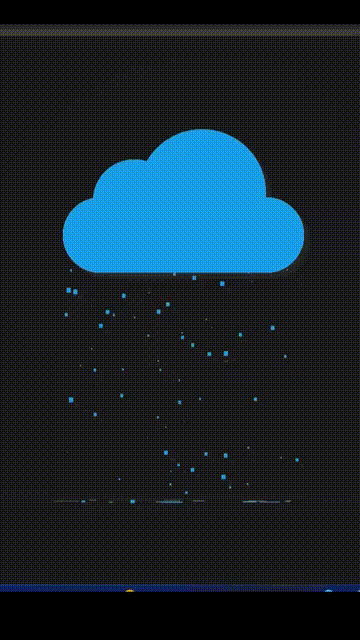

# Cloud, Rain, and Lightning Animation

This project showcases a simple animated weather scene using HTML, CSS, and JavaScript. The animation includes clouds, rain, and lightning effects, creating a dynamic visual representation of a stormy weather environment.

## 🖼️ Preview and Features

<table>
  <tr>
    <td>
      
    </td>
    <td>
      <ul>
        <li><strong>Cloud Animation:</strong> Realistic cloud movement with drop shadows for depth.</li>
        <li><strong>Rain Animation:</strong> Dynamic rain effect created using JavaScript.</li>
        <li><strong>Lightning Effect:</strong> Simulated lightning effect using CSS animations.</li>
      </ul>
    </td>
  </tr>
</table>

## 🛠️ Technologies Used

- **HTML**: Structure of the webpage.
- **CSS**: Styling for the clouds, rain, and lightning animations.
- **JavaScript**: Generates raindrops and animates them dynamically.

## 📂 Project Structure

- **index.html**: Contains the basic structure of the web page.
- **style.css**: Holds the CSS for styling and animations.
- **script.js**: JavaScript file responsible for creating the rain effect.

## 🚀 Getting Started

To run this project locally, follow these steps:

1. **Clone the repository:**
   ```bash
   git clone https://github.com/SajiaSohana/Rain-Cloud-Lightening-animation.git
   cd Rain-Cloud-Lightening-animation
   code .
   # Use Live Server